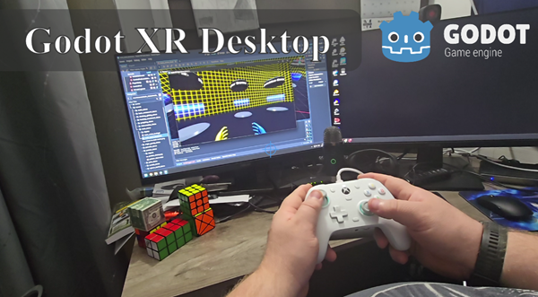

# Godot XR Desktop

Godot XR addon to allow XR games to be driven as a standard 3D experience.

## Versions

Official releases are tagged and can be found [here](https://github.com/Malcolmnixon/GodotXRDesktop/releases).

The following branches are in active development:
|  Branch   |  Description                  |  Godot version   |
|-----------|-------------------------------|------------------|
|  main     | Current development branch    |  Godot 4.3       |

## Standard Inputs

The following standard inputs (defined by the Godot Input Map) are supported:

| Input | Action |
| :--- | :----- |
| physical_move_forwards | Causes the virtual XR player to walk forwards (in the tracking space) |
| physical_move_backwards | Causes the virtual XR player to walk backwards (in the tracking space) |
| physical_move_left | Causes the virtual XR player to walk to their left (in the tracking space) |
| physical_move_right | Causes the virtual XR player to walk to their right (in the tracking space) |
| physical_crouch | Causes the virtual XR player to crouch |
| head_up | Rotate the head up |
| head_down | Rotate the head down |
| head_left | Rotate the head/player left |
| head_right | Rotate the head/player right |
| right-mouse-drag | Causes the head to look up/down and rotate left/right |

## Enable Addon

The addon files needs to be copied to the `/addons/godot-xr-desktop` folder of the Godot project, and then enabled in Plugins under the Project Settings:

## OpenXR Action Mapping

To drive OpenXR actions, entries must be constructed in the Godot Input Map for the appropriate actions:

Input entries must then be populated in the Godot XR Desktop Input Settings resource:

The following inputs may be defined:

| Input Resource Type | OpenXR Action |
| :------- | :----|
| GodotXRDesktopInputPressed | Boolean Action |
| GodotXRDesktopInputStrength | Float Action |
| GodotXRDesktopInputAxis | Float Action |
| GodotXRDesktopInputVector | Vector2D Action |
